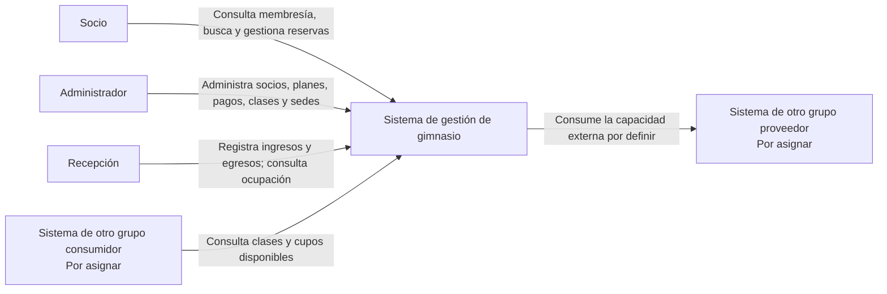
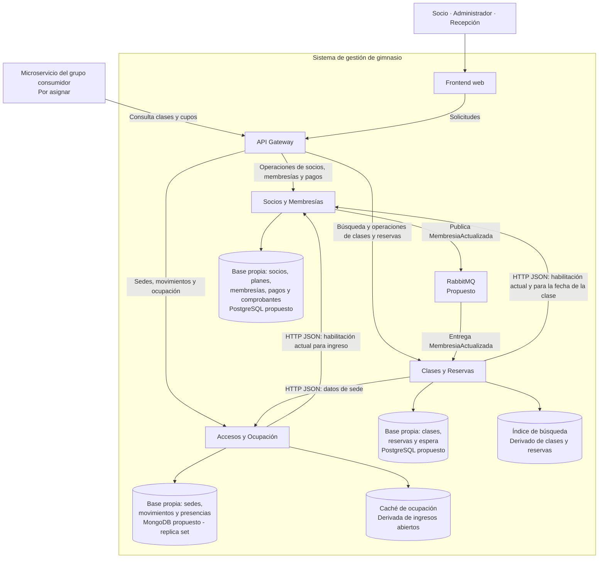

# Arquitectura preliminar - Entrega 1

Esta propuesta define los límites de los servicios, sus responsabilidades y la propiedad de los datos a partir del [alcance confirmado](ALCANCE_PRELIMINAR.md). Describe el diseño previsto: existe la estructura inicial de los tres servicios y un mock de consultas; las funciones de negocio todavía no están implementadas. La justificación se registra en [D1: límites de servicios y propiedad de los datos](adr/ADR-001-limites-de-servicios.md).

## Microservicios y responsabilidades

| Servicio | Responsabilidades | Quién utiliza sus funciones |
|---|---|---|
| **Socios y Membresías** | Administrar socios, planes y membresías; registrar y confirmar pagos; generar comprobantes internos; habilitar altas y renovaciones al confirmar su pago; informar vigencia y habilitación para una fecha; comunicar cambios que afecten esa habilitación. | El administrador gestiona los registros y pagos. El socio consulta su membresía. Los demás servicios consultan la habilitación. |
| **Clases y Reservas** | Publicar clases con sede, horario y capacidad; ofrecer búsqueda; gestionar reservas, cancelaciones y listas de espera; controlar duplicados, cupos y prioridad; cancelar reservas futuras afectadas por cambios de membresía y reasignar los cupos. | El administrador publica clases. El socio busca clases y gestiona sus reservas y su ingreso voluntario a la lista de espera. |
| **Accesos y Ocupación** | Administrar sedes; registrar intentos de ingreso y egresos; validar la membresía antes de aceptar un ingreso; exigir alternancia por socio y sede; mantener el historial y calcular la ocupación a partir de ingresos abiertos. | El administrador gestiona sedes. Recepción registra movimientos y consulta la información necesaria para operar. |

El **frontend web** presenta las funciones de cada actor. El **API Gateway** recibe las solicitudes del frontend y las dirige al servicio correspondiente. Ambos son componentes de la solución; los tres microservicios de negocio son los de la tabla.

## Propiedad de los datos

El propietario es el servicio que registra y modifica el dato y aplica sus reglas. El actor autorizado solicita la operación desde la aplicación; no escribe directamente en el almacenamiento.

| Dato | Servicio propietario | Uso en otros servicios |
|---|---|---|
| Socio y sus datos de identificación | Socios y Membresías | Reservas y accesos lo referencian mediante `socioId`. |
| Plan y sus características y vigencia | Socios y Membresías | Las condiciones de uso se consultan al propietario de la membresía. |
| Membresía: socio, plan, estado, vigencia y pagos asociados | Socios y Membresías | Clases y Reservas consulta la habilitación actual y para la fecha de la clase. Accesos y Ocupación consulta la habilitación actual para ingresar. |
| Pago y comprobante interno | Socios y Membresías | La habilitación resultante se comunica a través de la membresía. |
| Sede y sus datos identificatorios | Accesos y Ocupación | Cada clase referencia la sede mediante `sedeId`; Clases y Reservas consulta sus datos al propietario. |
| Clase: actividad, profesor asociado, nivel o categoría, sede, horario y capacidad máxima | Clases y Reservas | La sede se referencia por identificador. Los datos de actividad y profesor usados en las clases se mantienen en este servicio. |
| Reserva y su estado | Clases y Reservas | Referencia `socioId` y la clase. Socios y Membresías comunica cambios de habilitación y Clases y Reservas decide qué reservas se ven afectadas. |
| Lista de espera y orden de inscripción | Clases y Reservas | Se evalúa la membresía en Socios y Membresías antes de confirmar una promoción. |
| Cupos disponibles e índice de búsqueda de clases | Clases y Reservas | Son datos derivados de clases y reservas. El índice facilita la búsqueda; la confirmación de una reserva valida el cupo en el almacenamiento del servicio. |
| Intentos de ingreso, resultados, egresos e ingresos abiertos | Accesos y Ocupación | Referencian `socioId` y la sede. Su registro y las reglas de alternancia pertenecen a este servicio. |
| Ocupación de una sede y su caché de consulta | Accesos y Ocupación | La ocupación se deriva de los ingresos aceptados sin egreso asociado. La caché no reemplaza esos registros. |

Cada servicio tendrá almacenamiento propio. Ninguno leerá o modificará directamente las tablas o colecciones de otro: las referencias entre servicios se resolverán mediante sus interfaces. Los índices, cachés y posibles copias de consulta son derivados; su mantenimiento corresponde al servicio propietario del dato original.

## Persistencia inicial - D3

La propuesta de [D3](adr/ADR-003-persistencia.md) utiliza PostgreSQL para Socios y Membresías y para Clases y Reservas, con bases independientes, y MongoDB para Accesos y Ocupación. Las transacciones de accesos requieren iniciar MongoDB como replica set para guardar juntos el movimiento y el cambio de presencia. El historial queda separado de las presencias actuales; la ocupación se deriva de las presencias abiertas.

**Fuente:** sección 2.8, página 3; D3 en sección 5, página 6; versión inicial exigida en sección 6.2, página 8. Los productos concretos son decisiones propuestas, no nombres exigidos por el enunciado.

## Colaboración entre servicios

| Operación | Servicio responsable | Colaboración necesaria |
|---|---|---|
| Confirmar el pago de un alta o una renovación | Socios y Membresías | Conserva dentro del mismo servicio el pago, el comprobante y el efecto sobre la membresía, sin duplicarlos. |
| Publicar una clase en una sede | Clases y Reservas | Consulta la sede en Accesos y Ocupación y guarda su identificador. |
| Reservar o ingresar voluntariamente a la lista de espera | Clases y Reservas | Consulta la membresía en Socios y Membresías. Aplica las reglas de fecha, duplicados, capacidad y prioridad. |
| Liberar y reasignar un cupo | Clases y Reservas | Revalida cada candidato en Socios y Membresías; retira a los no habilitados y confirma al primero que cumple las condiciones, antes del inicio. |
| Suspender o perder la habilitación de una membresía | Socios y Membresías | Comunica el cambio mediante un evento. Clases y Reservas cancela las reservas futuras afectadas y aplica la reasignación. |
| Registrar un ingreso | Accesos y Ocupación | Consulta la habilitación actual en Socios y Membresías y controla que no exista un ingreso abierto del socio en esa sede. |
| Registrar un egreso y consultar ocupación | Accesos y Ocupación | Cierra el ingreso abierto y deriva la ocupación dentro de su propio límite. |

La propuesta de [D5](adr/ADR-005-comunicacion-entre-servicios.md) utiliza **HTTP con JSON** para esas consultas y **RabbitMQ** para el evento `MembresiaActualizada`. Incluye plazos de respuesta y reintentos iniciales, publicación recuperable, procesamiento idempotente y tratamiento de mensajes fallidos. Si la consulta de membresía falla durante una promoción, la persona permanece en espera y se conserva la reasignación pendiente con su prioridad.

**Fuente:** sección 2.5, página 2; D5 en sección 5, página 6; versión inicial exigida en sección 6.2, página 8. La elección de RabbitMQ y los valores iniciales de tiempos y reintentos son propuestas del diseño.

La comunicación asíncrona implica demora entre el cambio de membresía y la cancelación. La coordinación de ese cambio con una reserva concurrente y el control detallado de secuencias se precisarán en D4; los límites de servicios y estas decisiones iniciales no garantizan por sí solos atomicidad entre servicios.

## Capacidad propia para otro grupo

Se seleccionó **consulta de clases y cupos disponibles**, ofrecida por Clases y Reservas mediante dos operaciones de lectura. El [contrato y su documentación](contracts/README.md) definen datos, errores, autenticación, idempotencia y versión; [D8](adr/ADR-008-contrato-propio.md) registra la decisión.

El grupo consumidor todavía no fue asignado. El mock local está disponible al iniciar el entorno en `http://localhost:8080/api/v1/clases`, con datos ficticios y autenticación por clave. La implementación real y su URL pública están pendientes. La consulta de cupos no retiene lugares ni confirma que un socio pueda reservar.

## Diagrama de contexto

Muestra los actores y los sistemas externos. La capacidad propia está seleccionada; el consumidor y el proveedor externo están pendientes de asignación.

## Diagrama de contenedores

Muestra las aplicaciones y sus almacenes de datos, con los productos propuestos en D3 y D5. Los almacenes de Socios y Clases son bases independientes aunque puedan compartir una instancia local. El índice, la caché y el intermediario de mensajes no cuentan como microservicios de negocio.

La conexión al proveedor externo se ubicará en este diagrama cuando se conozca su capacidad. Nuestro consumo externo se realizará desde el microservicio responsable del flujo de negocio, según exige el enunciado.

## Estructura inicial ejecutable

Los tres servicios están en `services/`, cada uno con su paquete, configuración de TypeScript y proceso HTTP independiente. Se utiliza Node.js 22, TypeScript y Fastify como elección de implementación. El [inicio automatizado](../README.md#ejecutar-localmente) construye cada servicio con el Dockerfile de `infra/node/` y levanta sus dependencias con `compose.yaml`.

| Componente local | Configuración inicial | Estado funcional |
|---|---|---|
| Socios y Membresías | PostgreSQL, base y usuario `socios`; URL de RabbitMQ. | Proceso HTTP y salud; negocio y conexiones pendientes. |
| Clases y Reservas | PostgreSQL, base y usuario `clases`; URLs de RabbitMQ, Socios y Accesos. | Mock de las dos consultas OpenAPI con datos en memoria; negocio y conexiones pendientes. |
| Accesos y Ocupación | MongoDB, base y usuario `accesos`, replica set `rs0`; URL de Socios. | Proceso HTTP y salud; negocio y conexiones pendientes. |
| API Gateway | NGINX; único puerto local publicado. | Dirige las consultas del mock y las comprobaciones de salud. |

PostgreSQL 17 comparte una instancia local con dos bases y permisos separados; MongoDB 8.0 inicia un replica set de un nodo; RabbitMQ 4.1 conserva datos en un volumen. NGINX 1.28 y los servicios comparten la red interna de Compose. El frontend, el buscador y la caché del diagrama son componentes previstos y aún no se levantan.

**Fuente:** estructura inicial y dependencias en sección 6.2, página 8; título del hito con mock en página 7; procedimiento único de inicio en punto 2.12, página 4. Los productos, versiones, rutas de salud y archivos de configuración son elecciones para concretar esos requisitos.

## Revisión de la Entrega 1

La estructura y el mock están preparados para revisar junto al alcance, los diagramas y los ADR iniciales. La publicación de los cambios en el repositorio y la revisión del grupo siguen pendientes. La integración con el consumidor y el proveedor depende de su asignación.

Los patrones internos, los mecanismos concretos de concurrencia, el buscador y la caché se desarrollarán en sus ADR y en los hitos correspondientes. Este documento no agrega funcionalidades a las definidas en el alcance.
